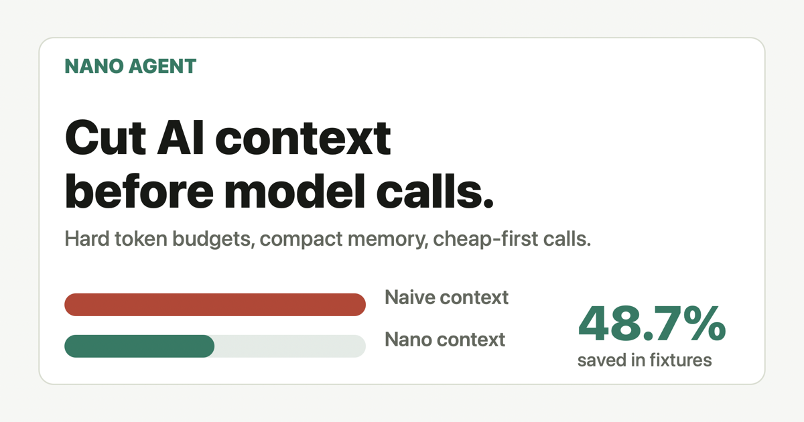

# Nano Agent

[](https://github.com/jacob-git/nano-agent/actions/workflows/ci.yml)
[](https://www.npmjs.com/package/@pallattu/nano-agent)
[](./LICENSE)

Tiny AI agents with strict token, memory, and cost budgets.

Nano Agent helps you build useful AI workflows without sending huge prompts, full chat history, or expensive model calls by default.

[Live demo](https://nano-agent.pages.dev) · [npm](https://www.npmjs.com/package/@pallattu/nano-agent)



```text
Task                Budget    Naive tokens  Nano tokens  Saved
refund reply       900       1,566         182          88.4%
support triage     1,000     1,717         157          90.9%
policy answer      1,200     2,389         148          93.8%
```

## Why

Most AI apps waste tokens by sending too much context:

- full chat history
- repeated instructions
- bloated policy text
- irrelevant retrieved context
- expensive models for simple tasks
- memory that is unrelated to the current goal

Nano Agent starts from one rule:

> No model call should exceed the budget unless you explicitly allow escalation.

## Why Not Full History?

Sending full chat history feels safe, but it usually makes AI apps slower, more expensive, and less focused. Old messages compete with the current task. RAG often adds noisy chunks beside the one passage that matters. Cheap-first routing only works when the cheap model receives a small, decisive packet.

Nano Agent makes that packet explicit. It builds context under a hard budget, drops low-priority sections, keeps recent messages tight, and returns a report showing exactly what was kept and dropped.

## What Makes It Nano

Nano Agent optimizes for restraint instead of maximum autonomy:

- hard input-token budget
- compact working memory
- recent-message window instead of full history
- smallest useful context packet
- cheap model first
- optional validation-based escalation
- run reports that show kept, dropped, and saved context

## Install

```sh
npm install @pallattu/nano-agent
```

## Quick Start

```ts
import OpenAI from "openai";
import { createNanoAgent, createOpenAIResponsesModel } from "@pallattu/nano-agent";

const openai = new OpenAI();

const agent = createNanoAgent({
  budget: {
    maxInputTokens: 1200,
    maxOutputTokens: 400,
  },
  models: {
    cheap: createOpenAIResponsesModel(openai, {
      model: "gpt-5-mini",
      reasoning: { effort: "low" },
    }),
  },
  memory: {
    constraints: ["Refunds over $100 require approval."],
    preferences: ["Use concise customer-facing language."],
  },
});

const result = await agent.run({
  goal: "Draft a customer refund response.",
  context: {
    policy,
    customerMessage,
    order,
  },
  messages,
});

console.log(result.output);
console.log(result.report);
```

## Demo

```sh
npm run demo
```

Example output:

```json
{
  "report": {
    "modelUsed": "nano-mini",
    "inputTokens": 505,
    "originalTokens": 846,
    "savedTokens": 341,
    "savedPercent": 40.3
  }
}
```

## Public Demo

[Try the live demo](https://nano-agent.pages.dev), or open `site/index.html` locally.

It lets users paste bloated context, set a token budget, and see:

- naive token estimate
- compact Nano Agent token estimate
- kept context
- dropped context
- generated compact packet

## Benchmark

```sh
npm run benchmark
```

Benchmarks are fixture-based and live in `benchmarks/fixtures/`, so the cases are easy to inspect and extend.

Example output:

```text
Nano Agent Benchmark

Task              Budget    Naive tokens  Nano tokens  Saved     Dropped
coding assistant  140       191           121          36.6%     1
long chat         130       208           116          44.2%     3
meeting summary   120       168           93           44.6%     1
policy answer     140       212           95           55.2%     1
RAG answer        150       243           114          53.1%     2
support ticket    160       328           153          53.4%     2

Total naive context: 1,350 tokens
Total nano context:  692 tokens
Total saved:         48.7%
```

## OpenAI Adapter

Nano Agent includes an adapter for the official OpenAI JavaScript SDK's Responses API.

```ts
import OpenAI from "openai";
import { createOpenAIResponsesModel } from "@pallattu/nano-agent";

const model = createOpenAIResponsesModel(new OpenAI(), {
  model: "gpt-5-mini",
  reasoning: { effort: "low" },
});
```

`openai` is an optional peer dependency so Nano Agent stays small for users who bring their own model adapter.

## Provider Adapters

Nano Agent ships structural adapters. You can use official SDK clients or compatible clients without adding hard runtime dependencies.

### OpenAI Responses

```ts
const model = createOpenAIResponsesModel(openai, {
  model: "gpt-5-mini",
});
```

### OpenAI-Compatible Chat

```ts
const model = createOpenAICompatibleChatModel(client, {
  model: "gpt-4.1-mini",
});
```

### Anthropic Messages

```ts
const model = createAnthropicMessagesModel(anthropic, {
  model: "claude-3-5-haiku-latest",
});
```

## CLI

Use the CLI to compact prompt/context JSON before a model call:

```sh
npx @pallattu/nano-agent budget \
  --input examples/prompt-budget.json \
  --max-input-tokens 120
```

Emit JSON for scripts:

```sh
npx @pallattu/nano-agent budget \
  --input examples/prompt-budget.json \
  --format json
```

Use it in CI:

```sh
npx @pallattu/nano-agent budget \
  --input prompts/support-ticket.json \
  --max-input-tokens 1200 \
  --fail-on-over-budget
```

See `examples/github-action/prompt-budget.yml` for a GitHub Actions workflow.

Or use the reusable action:

```yaml
- uses: jacob-git/nano-agent/action@v0
  with:
    input: prompts/support-ticket.json
    max-input-tokens: 1200
```

## Core Concepts

### Token Budget

Set `maxInputTokens`. Nano Agent builds a compact context packet and drops low-priority context before the model call.

### Working Memory

Memory is intentionally small:

- facts
- preferences
- constraints
- unresolved tasks

No vector database is required for v0.1.

### Cheap-First Execution

Use a cheap model first. Add a validator and strong model only when you want escalation.

```ts
const agent = createNanoAgent({
  budget: { maxInputTokens: 1200 },
  models: {
    cheap: miniModel,
    strong: frontierModel,
  },
  validator: (response) => ({
    ok: response.text.includes("required field"),
  }),
});
```

### Run Report

Every run returns:

- model used
- input tokens
- output tokens
- original context tokens
- saved tokens
- estimated cost
- context kept
- context dropped
- escalation status

## API

### `createNanoAgent(config)`

Creates a budgeted agent runtime.

### `agent.buildContext(input)`

Builds the compact context packet without calling a model.

### `agent.run(input)`

Builds compact context, calls the cheap model, validates output, and optionally escalates to the strong model.

### `buildNanoContext(input, config)`

Standalone context budgeter for any LLM call.

### `createNanoMemory(input)`

Creates a small working memory snapshot.

### `createOpenAIResponsesModel(client, options)`

Creates an adapter for `client.responses.create()`.

### `createOpenAICompatibleChatModel(client, options)`

Creates an adapter for OpenAI-compatible `client.chat.completions.create()`.

### `createAnthropicMessagesModel(client, options)`

Creates an adapter for Anthropic-compatible `client.messages.create()`.

### `getModelPricing(model)`

Returns a built-in pricing estimate when Nano Agent recognizes a model name.

### `createMockModel(options)`

Test/demo adapter for deterministic local examples.

## What This Is Not

Nano Agent is not a full agent framework, vector memory system, prompt engineering platform, workflow engine, or dashboard.

It is a small runtime primitive for this problem:

> Build the smallest useful context for the current task, run cheap first, and return the savings report.

## Roadmap

- JSON schema validator helper
- semantic context ranking
- cache-aware prompt layout
- hosted public benchmark corpus
- package-specific GitHub Action wrapper
